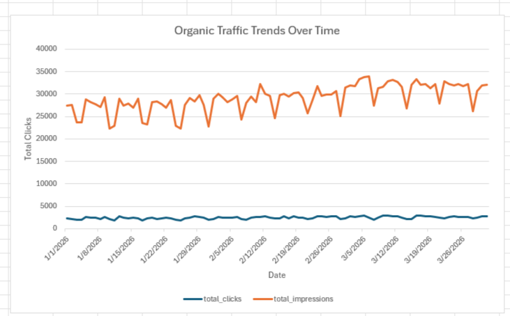
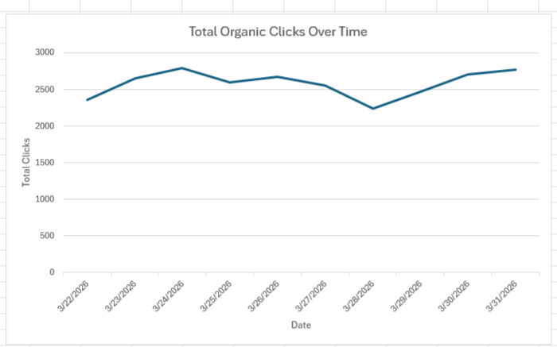
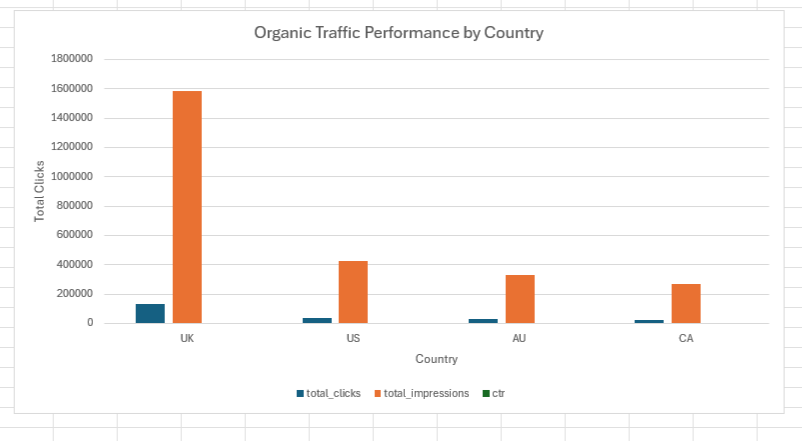
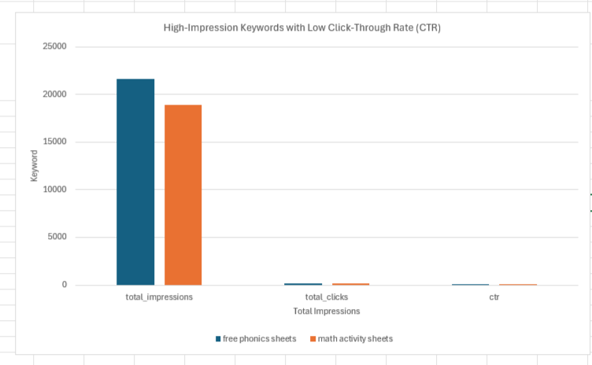
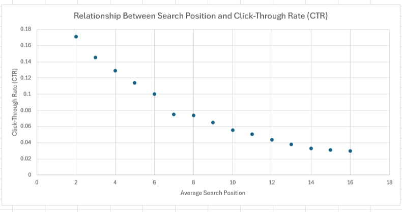
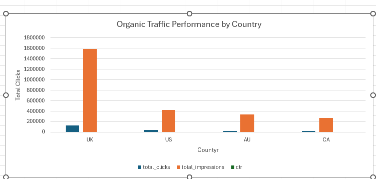

# seo-performance-analysis
End-to-end SEO data analysis project using SQL and Excel to uncover organic traffic trends, evaluate keyword performance, and identify optimisation opportunities based on CTR, ranking position, and user behaviour insights.
# SEO Performance Analysis: Organic Traffic & Keyword Insights


## Overview

This project analyses organic search performance data to identify traffic trends, high-performing content, and SEO optimization opportunities. The analysis focuses on how traffic is distributed across pages, keywords, regions, and ranking positions, and how those patterns can be translated into actionable recommendations for growth. The project uses SQL for querying and aggregation, and Excel for charting and visual storytelling.  
<!-- Supported by project report --> 

## Business Question

**Which pages, keywords, and traffic factors drive the strongest organic performance, and where are the optimization opportunities to improve SEO visibility and engagement?**

This project was designed to answer the following:
- Which pages generate the most organic clicks?
- Which keywords have high visibility but weak click-through performance?
- How does ranking position affect CTR?
- What traffic trends are visible over time?
- Are there meaningful differences by country and device?

## Dataset

This project uses a synthetic SEO dataset structured similarly to Google Search Console-style search performance data. The dataset includes the following fields:

- `date`
- `page`
- `keyword`
- `clicks`
- `impressions`
- `ctr`
- `avg_position`
- `device`
- `country`

> Note: The dataset is synthetic and was created for portfolio practice.

## Tools Used

- **SQL (SQLite)** — querying, filtering, aggregations, trend analysis
- **Excel** — data visualisation, chart design, performance interpretation
- **GitHub** — project documentation and portfolio presentation

## Process

### 1. Data Preparation
- Imported the SEO dataset into SQLite
- Checked field consistency and cleaned imported values
- Structured data for analysis-ready querying

### 2. SQL Analysis
Used SQL to answer key SEO performance questions:
- Top-performing pages by clicks
- Keywords with high impressions but weak CTR
- Organic traffic trends over time
- CTR vs search ranking relationship
- Country and device performance segmentation

### 3. Visualization
- Exported SQL result sets to CSV
- Built charts in Excel to present findings clearly
- Designed visuals to support stakeholder-style interpretation

### 4. Insight Development
- Interpreted performance patterns
- Identified optimization opportunities
- Connected findings to business and SEO implications

## Key Visuals

> Replace the image paths below with your actual file names in the `/image` folder.

### 1. Organic Traffic Trends Over Time


**What this shows:** Organic traffic follows a generally upward trend over time, suggesting consistent SEO performance growth with periodic fluctuations. This supports the conclusion that organic search performance is stable and improving overall.

---

### 2. Total Organic Clicks Over Time


**What this shows:** Daily organic clicks vary across the selected period but remain relatively stable, helping highlight short-term changes in user engagement and organic performance.

---

### 3. Organic Traffic Performance by Country


**What this shows:** The UK contributes the largest share of traffic, followed by the US, AU, and CA. This indicates a strong regional concentration and suggests where localisation or market prioritisation decisions may have the greatest impact.

---

### 4. High-Impression Keywords with Low CTR


**What this shows:** Keywords such as **“free phonics sheets”** and **“math activity sheets”** attract strong impressions but weak click-through rates, indicating clear SEO optimisation opportunities.

---

### 5. CTR vs Average Search Position


**What this shows:** Higher-ranking positions consistently achieve better CTR, confirming the importance of ranking improvement for organic traffic growth.

---

### 6. Top Performing Pages by Organic Clicks


**What this shows:** A limited number of pages drive a disproportionate share of total clicks, highlighting a concentrated content-performance pattern.

## Key Insights

- A small number of pages contribute disproportionately to organic traffic.
- High-impression keywords with low CTR represent missed opportunities for optimization.
- Search position has a strong influence on CTR and traffic performance.
- Organic traffic shows a stable upward trend across the period analysed.
- Traffic performance is regionally concentrated, with the UK leading.

## Business Implications

This analysis matters because it shows how SEO data can guide real business decisions:

- Improving CTR on high-impression keywords could increase traffic without publishing new content.
- Prioritising high-performing content themes may improve content strategy ROI.
- Ranking improvements can directly increase user engagement and organic traffic.
- Regional traffic patterns can inform localisation and market planning.
- SEO performance can be monitored more effectively when analysis is connected to business outcomes, not just metrics.

## Challenges

### 1. Synthetic dataset limitations
The dataset is synthetic, so it does not capture all the complexity of real-world SEO behaviour.

**How to improve:** Use real exports from Google Search Console and GA4 in future versions.

### 2. No direct conversion data
This project focuses on search visibility and engagement, not downstream business conversion.

**How to improve:** Add conversion and session-quality metrics from analytics platforms.

### 3. Limited keyword variety
A broader keyword universe would allow more advanced clustering and content strategy analysis.

**How to improve:** Expand the dataset with more queries, landing pages, and search segments.

## What I Would Improve Next

If I extended this project further, I would:

- Integrate **GA4 + Search Console** style data for more complete SEO analysis
- Build an interactive dashboard in **Power BI** or **Looker Studio**
- Add **keyword clustering** and content theme analysis
- Include **conversion and engagement metrics**
- Simulate **SEO experiments / title tag changes** and estimate CTR uplift
- Explore **forecasting** for future organic traffic trends

- ## SQL Queries

All analysis queries used in this project can be found here:

[View SQL Queries](sql/queries.sql)

## Repository Structure

```bash
seo-analysis/
│
├── data/
│   └── synthetic_seo_performance_dataset.csv
│
├── sql/
│   └── queries.sql
│
├── visuals/
│   ├── traffic_trends.png
│   ├── total_organic_clicks.png
│   ├── country_performance.png
│   ├── low_ctr_keywords.png
│   ├── ctr_vs_position.png
│   └── top_pages.png
│
├── report/
│   └── SEO_Performance_Analysis.docx
│
└── README.md
